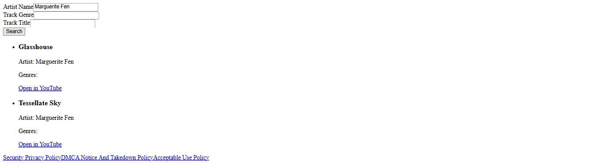
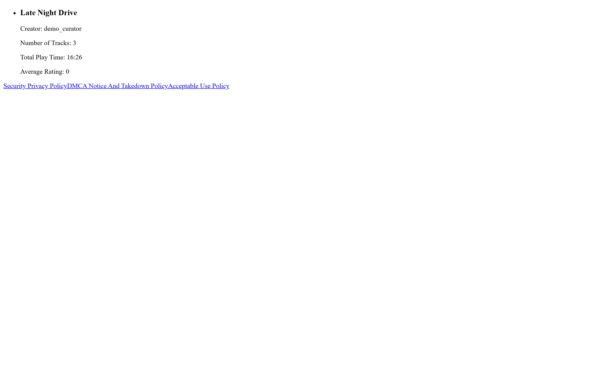

# Music Playlist Manager

A full-stack music library and playlist app. Anyone can search a track catalogue by artist, title or
genre and browse the most recently updated public playlists. With an account you build your own
playlists, add tracks to them, review other people's, and — if you're an admin — moderate reviews,
deactivate accounts and publish the site's policy pages.

What makes it worth reading is the auth layer. It is a real one: bcrypt-hashed passwords, short-lived
JWT access tokens, refresh tokens in `httpOnly` cookies, email-verified signup, and a three-tier route
structure where the middleware order itself enforces the boundary.



## What it does

**Three tiers of access, enforced by middleware order.** `server/app.js` mounts the public routes,
then installs `checkJWT`, then mounts everything else — so no authenticated route can be reached
without a valid token, by construction rather than by remembering to guard each handler:

```js
app.use('/api/account/', ...)   // register, verify, login, refresh — public
app.use('/api/open/', ...)      // track search, top playlists, policies — public
app.use(checkJWT);              // <- the boundary
app.use('/api/secure/', ...)    // playlists: create, edit, delete, add/remove tracks, review
app.use('/api/admin/', ...)     // + verifyRole("Admin") on every handler
```

**Signup is email-verified, and the pending account never touches the database.** `POST /register`
hashes the password, packs username, email and hash into a 1-day JWT, and mails a verification link
containing that token. The user record is only created when `GET /verify/:token` decodes it. An
abandoned signup leaves nothing behind.

**Login issues two tokens.** A 300-second access token carrying username and role, returned in the
body for the `Authorization: Bearer` header, plus a 1-day refresh token stored on the user document
and set as an `httpOnly`, `sameSite: None`, `secure` cookie. `/api/refresh` trades the cookie for a
fresh access token. Deactivated accounts are rejected at login before any password comparison.

**Playlists.** Create up to 20, add and remove tracks, edit the name and description, toggle
public/private, delete. The server recomputes `number_of_tracks` and `total_play_time` on every track
change — adding a 3:42, a 7:11 and a 5:33 leaves the playlist reading `16:26`. Other users can leave
reviews, and an admin can hide a review without deleting it.

**Track search** is a case-insensitive regex match on artist, title and genre, capped at 20 results,
and each result carries a generated YouTube search link so you can actually go listen to it.

**Policy pages** — security/privacy, DMCA notice-and-takedown, acceptable use — are stored in the
database and edited by admins through the app, not hardcoded in templates. `docs/policy-workflow.md`
describes what belongs in each.



## Use case

A reference implementation of session-less JWT auth on a MEAN-ish stack, at the size where you can
still read the whole thing. The access/refresh split, the `httpOnly` refresh cookie, the verify-by-
token signup and the role middleware are all small enough to follow end to end in an afternoon.

The file worth reading is **`server/routes/account.js`** — register, verify, login, refresh and
password update in one place, about 200 lines, covering the whole credential lifecycle. Read
`server/middleware/checkJWT.js` next; it is 20 lines and it is the entire authentication boundary.

## Tech stack

**Backend** — Node.js, Express 4, MongoDB via Mongoose 6, `jsonwebtoken`, `bcrypt` (cost 10),
`cookie-parser`, `nodemailer` for verification email, `dotenv`.

**Frontend** — Angular 15, TypeScript, 14 components with client-side routing, talking to the API
through a dev-server proxy so there is no CORS configuration to maintain.

## Configuration

The server reads five environment variables. Create `server/.env`:

| Variable | What it is | Where to get it |
|---|---|---|
| `DATABASE_URI` | MongoDB connection string | `mongodb://localhost:27017/musicplaylist` for a local or Docker MongoDB, or an Atlas `mongodb+srv://` URI |
| `ACCESS_TOKEN_SECRET` | Signing key for 300-second access tokens | Generate one: `node -e "console.log(require('crypto').randomBytes(32).toString('hex'))"` |
| `REFRESH_TOKEN_SECRET` | Signing key for 1-day refresh tokens | Generate a second, different one the same way |
| `EMAIL_USERNAME` | Gmail address that sends verification mail | A Gmail account you control |
| `PASSWORD` | Gmail **app password** for that account | Google Account → Security → 2-Step Verification → App passwords. A normal account password will not work. |

`server/.env` is gitignored. Without valid mail credentials everything works except `POST
/api/account/register`, which cannot deliver its verification link — see below for how to create an
account anyway.

## Running locally

You need **Node.js**, **npm**, and a **MongoDB** instance. Three terminals.

**1. MongoDB.**

```bash
docker run -d --name mpm-mongo -p 27017:27017 mongo:6
```

**2. The API.**

```bash
cd server
npm install
# create .env as described above
node app.js
```

It prints `Connected to MongoDB` and `Listening on port 3000`.

**3. The Angular client.**

```bash
cd client
npm install
npm start
```

Open **http://localhost:4200**. `proxy.conf.json` forwards `/api/*` to port 3000, so both halves work
from that one origin.

**Creating an account without mail credentials.** Signup needs working Gmail SMTP. To get a usable
account without it, mint the verification token yourself and call the endpoint the email would have
linked to:

```bash
cd server
node -e "
require('dotenv').config();
const jwt=require('jsonwebtoken'), bcrypt=require('bcrypt');
bcrypt.hash('YourPassword123!',10).then(h=>console.log(jwt.sign(
  {UserInformation:{username:'demo_curator',emailAddress:'demo@example.com',password:h}},
  process.env.ACCESS_TOKEN_SECRET,{expiresIn:'1d'})));"
# then:
curl http://localhost:3000/api/account/verify/<the token it printed>
```

That runs the same account-creation code path the emailed link does. To make an admin instead, set
that user's `role` to `Admin` in MongoDB.

**The catalogue starts empty.** No track data ships with this repository, so search returns nothing
until you load some. Any documents matching the `Track` schema in `server/model/track.js` will do:

```js
db.Tracks.insertOne({
  track_title: "Neon Harbour", artist_name: "Violet Ampersand",
  album_title: "Signal Drift", track_genres: ["Synthwave", "Electronic"],
  track_duration: "3:42", track_date_created: "2021-04-12"
})
```

**Verify the API directly:**

```bash
curl -X POST http://localhost:3000/api/open/tracks -H 'Content-Type: application/json' \
     -d '{"artist_name":"violet"}'
curl -i http://localhost:3000/api/secure/playlist/view-all    # 401 without a token
```

## Project layout

```
server/              Express API
├── app.js           Mongo connection, middleware order, route mounting
├── routes/          account (auth lifecycle), open (public), secure (playlists), admin, refresh
├── middleware/      checkJWT — the auth boundary; verifyRole — admin gate
└── model/           Mongoose schemas: user, track, playlist, assignPlaylist, 3x policy
client/              Angular 15 app
└── src/app/         14 components — welcome, login, create-account, homepages,
                     playlist create/delete, add-review, top-playlists, query-track, policies
docs/
└── policy-workflow.md   what each of the three policy documents should contain
assets/screenshots/  screenshots of the running app
```

## Credits

Built with a team of 2.

*Originally built as a course project at Western University.*
